# workflow
### A git-native, offline-friendly workflow orchestrator for deterministic local execution

[](https://goreportcard.com/report/github.com/joelfokou/workflow)
[](https://github.com/joelfokou/workflow/releases)
[](LICENSE)
[](https://pkg.go.dev/github.com/joelfokou/workflow)

---

`workflow` (CLI: `wf`) is a minimal, deterministic workflow orchestrator designed for running task pipelines locally without infrastructure overhead.

It is built for developers, data engineers, and system operators who want **predictable, inspectable, reproducible workflows** without running a scheduler, daemon, or web server.

Workflows are defined in **TOML**, executed in **topological order**, and persisted in a **local SQLite database** for full auditability.


## Why workflow?

Most workflow orchestrators are built for distributed systems first.  
`workflow` is built for **local-first execution**.

**workflow is for you if you want:**

- Deterministic execution order
- Git-versioned workflows
- Offline execution
- One static binary
- No background services
- Persistent run history
- Clear failure semantics
- Easy debugging via logs and metadata

**workflow is not trying to replace Airflow, Dagster, or Temporal.**  
It intentionally focuses on the **local execution problem** and does it well.


## Demonstration


## Key Features
  - Designed to be versioned, reviewed, and diffed like code
  - No internet required; perfect for secure or remote environments


## Key Features

- **Deterministic & Auditable**
  - Strict topological execution order (DAG)
  - Full SQLite audit trail of every run, task, and retry attempt

- **Git-Native & Human-Readable**
  - Workflow definitions are simple TOML files
  - Designed to be versioned, reviewed, and audited

- **Stateful Resume**
  - Fix a bug and resume execution exactly where it failed (`wf resume <run-id>`)
  - Successfully completed tasks are skipped automatically

- **Local-First & Air-Gap Ready**
  - Single static binary with zero external dependencies
  - All state stored locally, perfect for secure or remote environments

- **Persistent run history**
  - Runs and task metadata stored in SQLite
  - Queryable via CLI

- **Resilient Execution**
  - Configurable retries for flaky operations
  - Structured logs captured per-task for debugging

- **Structured logging**
  - Per-task logs
  - Global application logs
  - JSON output supported for automation

- **Cross-platform**
  - Linux, macOS, and Windows


## Common Use Cases

`workflow` bridges the gap between simple shell scripts (which lack structure) and heavy orchestrators like Airflow (which require infrastructure).

### 1. Local Data Engineering & ETL
Develop and test data pipelines locally without spinning up Docker containers for Airflow or Dagster.

- **The Problem:** Running a heavy scheduler just to test a 3-step SQL transformation is overkill.
- **The Solution**: Define your generic ETL steps in TOML. Run them instantly with `wf run`.
- **Benefit**: Fast iteration loops with **built-in retries** for flaky network calls (e.g., fetching data from an API).

### 2. Replacing "Mega-Shell-Scripts"
Complex setup scripts (e.g., `setup_env.sh`) often grow unmaintainable, lacking error handling or resume capabilities.

- **The Problem**: If line 50 of a 100-line bash script fails, you often have to manually cleanup or restart from scratch.
- **The Solution**: Break the script into granular tasks with defined `depends_on` relationships.
- **Benefit**: If a task fails, `workflow` saves the state in SQLite. Fix the error, then resume exactly where you left off (*idempotency required in your commands*).

### 3. Edge & Remote Node Operations
Manage complex maintenance sequences on air-gapped servers, factory nodes, or remote devices where deploying Kubernetes is impossible.

- **The Problem**: You need to run a complex upgrade sequence on a remote Linux box, but if the internet cuts out or a script errors, the node is bricked.
- **The Solution**: Ship the single `wf` binary and a TOML definition.
- **Benefit**: The local SQLite state ensures that even if the machine reboots or the connection dies, the workflow knows exactly where it stopped and can resume safely.

### 4. Reproducible Machine Learning Experiments
Run data preprocessing, training, and evaluation steps in a strict, reproducible order.

- **The Problem**: Jupyter notebooks execute out-of-order, leading to *"works on my machine"* issues.
- **The Solution**: Enforce **topological execution order** for your experiment pipeline.
- **Benefit**: Every run is logged and persisted. You can audit exactly which run ID produced a specific model artifact.

### 5. CI/CD Step Orchestration
Since `wf` is a **single static binary**, it is trivial to drop into a CI pipeline (GitHub Actions, GitLab CI).

- **The Problem**: YAML files in CI tools are often hard to run locally for debugging.
- **The Solution**: Define your build/test logic in `workflow`.
- **Benefit**: Run the **exact same command**(`wf run build`) on your local machine as your CI server does.


## Installation


### Method 1: Pre-built Binaries (Recommended)
Download the latest binary for your operating system from the [Releases Page](https://github.com/joelfokou/workflow/releases).

#### Linux & macOS

```bash
# 1. Download and extract (example for macOS Apple Silicon)
tar -xzf wf_0.1.0_darwin_arm64.tar.gz

# 2. Move binary to your path
sudo mv wf /usr/local/bin/

# 3. Verify installation
wf --version
```

#### Windows

1. Download `wf_0.1.0_windows_amd64.zip`.
2. Extract the archive.
3. Add the extracted folder to your System `PATH` environment variable.
4. Open PowerShell and run `wf --version`.

### Method 2: Build from source
If you have Go installed (1.21+) and prefer to compile it yourself:

```bash
git clone https://github.com/joelfokou/workflow.git
cd workflow
go build -o wf .
# Move 'wf' to somewhere in your $PATH
```


## Quick Start

### 1. Initialise workspace

```bash
wf init
```
This creates the required directories, initialises the local database and creates the default configuration file.
- `config.yaml`: Default configuration file
- `workflows`: For your workflows
- `logs`: Application and run logs
- `workflow.db`: Application and run store

#### Customising paths

- `workflow` creates a default configuration file on first initialisation.
- To customise where workflows, logs, and database are stored, edit the config file. The path is displayed when you run `wf init`.
- You may also choose to use a custom config location: `wf --config <config-file> init`.


#### Default locations

| OS | Config directory | Data directory |
| ------- | -------| ------- |
| Linux | `~/.config/workflow` | `~/.cache/workflow` |
| macOS | `~/Library/Application Support/workflow` | `~/Library/Caches/workflow` |
| Windows | `%AppData%\workflow` | `%LocalAppData%\workflow` |

### 2. Define a workflow

Create a file in the `workflows` directory:

```toml
name = "example"

[tasks.extract]
cmd = "echo 'hello world' > /tmp/data.txt"

[tasks.transform]
depends_on = ["extract"]
cmd = "cat /tmp/data.txt | tr a-z A-Z"

[tasks.load]
depends_on = ["transform"]
cmd = "wc -c /tmp/data.txt"
```

### 3. Validate workflows
Validate all workflows presents in the `workflows` directory
```
wf validate
```

Validate a single workflow:
```
wf validate example
```

JSON output:
```
wf validate --json
```

### 4. Run a workflow
```
wf run example
wf run example --dry-run
```

Execution is:

- Deterministic
- Fail-fast
- Persisted in the local database

### 5. Recover from failure
If a run fails (e.g., network glitch), you don't need to restart from scratch.

1. List runs to find the failed ID:
   ```bash
   wf runs --status failed
   ```
2. Resume execution:
   ```bash
   wf resume <run-id>
   ```

`workflow` will load the previous state, skip all tasks that already succeeded, and retry only the failed steps.

### 6. Inspect runs
```
wf runs
```

Filter and paginate:
```
wf runs --workflow example --status success --limit 5
```

JSON output:
```
wf runs --json
```

### 7. View logs
```
wf logs <run-id>
wf logs <run-id> --task <task-id>
```

### 8. Visualise the DAG
Displays the workflow structure for inspection and debugging.
```
wf graph example
wf graph example --detail --format ascii
```


## Workflow Definition (TOML)

Each workflow file defines a DAG of tasks.

### Workflow constraints

1. **Name**: Every workflow file ***must*** have a name.
2. **Task name syntax**: Task names should have the syntax `tasks.<task_name>` during definition.
3. **Cycles**: The workflow should not have cycles.
4. **Missing dependencies**: Tasks should not depend on inexistent tasks.
5. **Valid characters**: Task names should ***only*** contain alphanumerical characters, hyphen or underscore.
6. **Duplicate task names**: The task names in the DAG should be ***unique***.
7. **Tasks should exist**: The workflow should contain ***at least one*** task.
8. **Task should have command**: Every task ***must*** have a ***command (cmd)*** defined.


### Task fields

| Field | Description|
| ------ | ---------|
| `cmd` |	Shell command to execute |
| `depends_on` | List of upstream task names |
| `retries` | Number of retry attempts (default: 0) |

Example:
```toml
name = "some_workflow"

[tasks.task_name]
cmd = "echo hello"
depends_on = ["another_task"]
retries = 2
```


## Design & Architecture

`workflow` operates entirely in user-space. There are no daemons, agents, or background services.

```mermaid
graph TD
    subgraph "User Space"
        TOML["📄 Workflow Definition<br>(TOML)"]
        CLI["💻 CLI Input<br>(wf run)"]
    end

    subgraph "wf (Static Binary)"
        Parser["1. Parser & Validator"]
        DAG["2. DAG Builder<br>(Topological Sort)"]
        Executor["3. Task Executor<br>(Retries & Shell Ops)"]
    end

    subgraph "Local Persistence"
        DB[("🗄️ SQLite DB<br>(Run History & State)")]
        Logs["📝 Structured Logs"]
    end

    TOML --> Parser
    CLI --> Parser
    Parser --> DAG
    DAG --> Executor
    Executor -- "Executes" --> System["🖥️ System Shell"]
    Executor -- "Persists Metadata" --> DB
    Executor -- "Streams Output" --> Logs
```



### How it works

1. **Parse**: The CLI reads your TOML file and validates the structure.
2. **Plan**: It builds a Directed Acyclic Graph (DAG) to determine the deterministic execution order.
3. **Execute**: Tasks are executed sequentially ***(or parallel in future versions)***.
4. **Persist**: Every state change (start, success, fail, retry) is immediately committed to the local SQLite database. This ensures that if the process is killed (Ctrl+C), the state is preserved.


## CLI Reference
```bash
wf is a minimal, deterministic workflow orchestrator.

Usage:
  wf [command]

Available Commands:
  init        Initialise workflow directories and database
  validate    Validate workflow definitions
  run         Run a workflow (always starts a fresh run)
  resume      Resume a failed workflow run from the point of failure
  list        List workflows
  runs        List workflow runs
  logs        Show logs for a run or task
  graph       Display workflow DAG structure
  completion  Generate shell completion
```


## Execution Model 

### Guarantees

workflow guarantees the following:

- Topological execution order
- Deterministic task ordering
- Fail-fast semantics
- Per-task retries
- Persistent run metadata
- Persistent per-task logs
- Graceful cancellation (Ctrl+C)

If a task fails after all retries:
- Downstream tasks do not run
- Workflow run is marked as failed
- Logs and metadata are preserved


### Non-Goals (by design)

workflow intentionally does **not** provide:

- Distributed execution
- Scheduling / cron
- Web UI
- Long-running daemon
- Remote agents
- Kubernetes-native execution

These may be explored in the future, but they are **explicitly out of scope** today.


## Configuration

Configuration follows a strict priority order:

1. Command-line flags
2. Config file
3. Environment variables
4. Built-in defaults


### Common flags
```bash
--config <path>       Override config file
--log-level           debug | info | warn | error
--verbose             Enable verbose output
--version             Show version
```


## Observability & State

- Run metadata is stored in **SQLite**
- One record per workflow run
- One record per task execution
- Logs stored per task per attempt
- All state is inspectable and portable

This makes workflow runs:

- Auditable
- Debuggable
- Reproducible


## When should you **NOT** use workflow?

- You need distributed execution
- You need scheduling / cron
- You need a UI
- You need long-running services
- You need Kubernetes-native workflows

workflow is optimised for **local execution**, not orchestration at scale.


## Roadmap (high level)

- Optional taks support
- Improved DAG visualisation
- Parallel execution (local)
- Workflow templates
- Workflow exports
- Metadata dump (for audits)

No defined order. No timeline.


## Licence

This project is licensed under the Apache License 2.0. You can read the [LICENSE](LICENSE) file for details.


## Contributing

Please read the [Contribution Guide](CONTRIBUTING) for details.